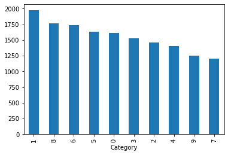
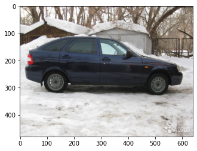
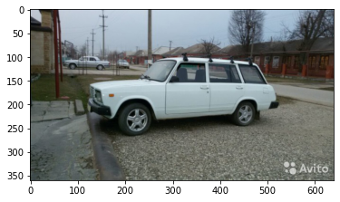
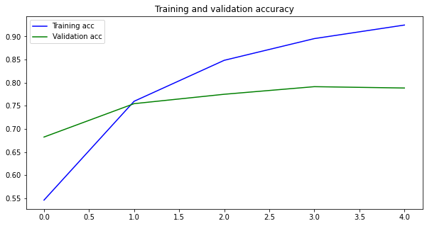
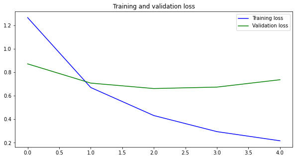
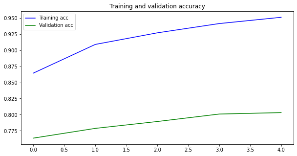
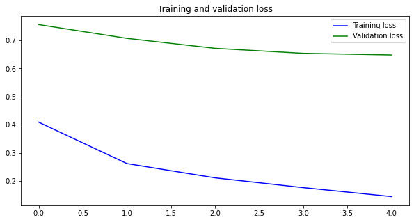

# Cars Recognition

The goal of this project is to practice Transfer learning and Fine Tuning on the task of recognizing car brands from a photograph.


```python
import os, re, math, random, time, gc, string, pickle, shutil, pathlib, itertools
import numpy as np, pandas as pd, matplotlib.pyplot as plt, PIL

import tensorflow as tf
#import tensorflow_addons as tfa
from tensorflow import keras
from tensorflow.keras import *
from tensorflow.keras.activations import *
from tensorflow.keras.applications import *
from tensorflow.keras.callbacks import *
from tensorflow.keras.layers import *
from tensorflow.keras.layers.experimental.preprocessing import *
from tensorflow.keras.losses import *
from tensorflow.keras.optimizers import *
from tensorflow.keras.optimizers.schedules import *
from tensorflow.keras.preprocessing.image import ImageDataGenerator

from PIL import Image
from IPython.display import clear_output
from tqdm.notebook import tqdm
```


```python
sample_submission_path = "./sf-dl-car-classification_project_7/sample-submission.csv"
train_path = "./sf-dl-car-classification_project_7/train"
sub_path = "./sf-dl-car-classification_project_7/test_upload"

```

#### EDA

We need to classify cars belonging to 10 classes. The distribution among these classes is fairly even


```python
train_df = pd.read_csv(train_path+"/train.csv")
train_df.Category.value_counts().plot(kind = "bar", xlabel = "Category")
```


    <AxesSubplot:xlabel='Category'>


    

    


```python
image = PIL.Image.open(train_path+'/train/0/100380.jpg')
imgplot = plt.imshow(image)
plt.show()
image.size
```


    

    


    (640, 480)


```python
image = PIL.Image.open(sub_path  +"/805.jpg")
imgplot = plt.imshow(image)
plt.show()
image.size
```


    

    


    (640, 360)


```python
def show_first_images(generator, count=6, labels=True, figsize=(20, 5), normalized=False):
  generator = itertools.islice(generator, count)
  fig, axes = plt.subplots(nrows=1, ncols=count, figsize=figsize)
  for batch, ax in zip(generator, axes):
    if labels:
      img_batch, labels_batch = batch
      img, label = img_batch[0], np.argmax(labels_batch[0]) #берем по одному изображению из каждого батча
    else:
      img_batch = batch
      img = img_batch[0]
    if not normalized:
      img = img.astype(np.uint8)
    ax.imshow(img)
    # метод imshow принимает одно из двух:
    # - изображение в формате uint8, яркость от 0 до 255
    # - изображение в формате float, яркость от 0 до 1
    if labels:
      ax.set_title(f'Class: {label}')
  plt.show()

print('Train:')
show_first_images(train_generator)

print('Val:')
show_first_images(val_generator)

print('Sub:')
show_first_images(sub_generator, labels=False)
```

    Train:
    


    

    


    Val:
    


    

    


    Sub:
    


    

    


```python
image_size = (90, 120)
batch_size = 32
RANDOM_SEED = 42
input_shape = (*image_size, 3)
```


```python
train_datagen = ImageDataGenerator(
    #rescale=1/255,
    validation_split=0.2,
    # ниже параметры аугментаций:
    horizontal_flip=True,
    rotation_range=10,
    shear_range=0.2,
    brightness_range=(0.8, 1.2),
)

val_datagen = ImageDataGenerator(
    #rescale=1/255,
    validation_split=0.2,
)

sub_datagen = ImageDataGenerator(
    #rescale=1/255
)
```

#### Data Augmentation


```python
train_generator = train_datagen.flow_from_directory(
    train_path,
    target_size=image_size,
    batch_size=batch_size,
    class_mode='categorical',
    shuffle=True,
    seed=0,
    subset='training'
)

val_generator = val_datagen.flow_from_directory(
    train_path,
    target_size=image_size,
    batch_size=batch_size,
    class_mode='categorical',
    shuffle=True,
    seed=0,
    subset='validation'
)

sub_generator = sub_datagen.flow_from_dataframe( 
    dataframe=pd.read_csv(sample_submission_path),
    directory=sub_path,
    x_col="Id",
    y_col=None,
    class_mode=None,
    target_size=image_size,
    batch_size=batch_size,
    shuffle=False
)
```

    Found 12452 images belonging to 10 classes.
    Found 3109 images belonging to 10 classes.
    Found 6675 validated image filenames.
    

#### EfficientNetB0


```python
model = Sequential([
  EfficientNetB0(weights='imagenet', input_shape=(*image_size, 3), include_top=False), #предобученная нейросеть из модуля keras.applications
  GlobalMaxPool2D(),
  Dropout(0.5),
  Dense(10)
])

model.compile(
    loss=CategoricalCrossentropy(from_logits=True),
    optimizer=Adam(ExponentialDecay(1e-3, 100, 0.9)),
    metrics='accuracy'
)
```


```python
model.fit(train_generator, validation_data=val_generator, epochs=1)
```

    390/390 [==============================] - 1090s 3s/step - loss: 2.1743 - accuracy: 0.3984 - val_loss: 1.0196 - val_accuracy: 0.6359
    


    <keras.callbacks.History at 0x217871971c0>


```python
def plot_history(history):
    plt.figure(figsize=(10,5))
    #plt.style.use('dark_background')
    acc = history.history['accuracy']
    val_acc = history.history['val_accuracy']
    loss = history.history['loss']
    val_loss = history.history['val_loss']

    epochs = range(len(acc))

    plt.plot(epochs, acc, 'b', label='Training acc')
    plt.plot(epochs, val_acc, 'g', label='Validation acc')
    plt.title('Training and validation accuracy')
    plt.legend()

    #plt.figure()
    plt.figure(figsize=(10,5))
    #plt.style.use('dark_background')
    plt.plot(epochs, loss, 'b', label='Training loss')
    plt.plot(epochs, val_loss, 'g', label='Validation loss')
    plt.title('Training and validation loss')
    plt.legend()

    plt.show()

plot_history(history)
```

loss: 1.1413 - accuracy: 0.6037


```python

```

### Fine Tunung

EfficientNetB7 will as a basis for transfer learning. Let's fine tune it

#### Step 1

 Base model stays freezed


```python
base_model_02= EfficientNetB7(weights='imagenet', include_top=False, input_shape=input_shape)
base_model_02.trainable = False
```

Let's add fully-connected and logistic layers 

model_02=Sequential()
model_02.add(base_model_02)
model_02.add(GlobalAveragePooling2D(),)
model_02.add(Dense(10, activation='softmax'))
model_02.summary()


```python
print("The hodel has ", len(model_02.layers), " layers")
print(len(model_02.trainable_variables), " of them are trainable")
```


```python
for layer in model_02.layers:
    print(layer, layer.trainable)
```

    <keras.engine.functional.Functional object at 0x00000217DF9EF5E0> False
    <keras.layers.pooling.GlobalAveragePooling2D object at 0x00000217C5824430> True
    <keras.layers.core.dense.Dense object at 0x00000217E38C5EE0> True
    


```python
model_02.compile(loss="categorical_crossentropy", optimizer=optimizers.Adam(learning_rate=0.001), metrics=["accuracy"])
```


```python
scores = model_02.evaluate(val_generator, verbose=1)
print("Accuracy: %.2f%%" % (scores[1]*100))
```

    98/98 [==============================] - 333s 3s/step - loss: 2.3282 - accuracy: 0.1042
    Accuracy: 10.42%
    

Let's assign callbacks for fitting the model. The first of them is for saving checkpoints of the model, the second one should stop the learning if the model starts to overfit.


```python
checkpoint = ModelCheckpoint('best_model.hdf5' , monitor = ['val_accuracy'] , verbose = 1  , mode = 'max')
earlystop = EarlyStopping(monitor='val_accuracy', patience=5, restore_best_weights=True)
callbacks_list = [checkpoint, earlystop]
```


```python
# Обучаем
history = model_02.fit(
                    train_generator,
                    steps_per_epoch = train_generator.samples//train_generator.batch_size,
                    validation_data = val_generator, 
                    validation_steps = val_generator.samples//val_generator.batch_size,
                    epochs = 5,
                    callbacks = callbacks_list
                    )
```

    Epoch 1/5
    389/389 [==============================] - ETA: 0s - loss: 1.8667 - accuracy: 0.3280
    Epoch 00001: saving model to best_model.hdf5
    389/389 [==============================] - 1824s 5s/step - loss: 1.8667 - accuracy: 0.3280 - val_loss: 1.6870 - val_accuracy: 0.4159
    Epoch 2/5
    389/389 [==============================] - ETA: 0s - loss: 1.6181 - accuracy: 0.4300
    Epoch 00002: saving model to best_model.hdf5
    389/389 [==============================] - 1738s 4s/step - loss: 1.6181 - accuracy: 0.4300 - val_loss: 1.5632 - val_accuracy: 0.4449
    Epoch 3/5
    389/389 [==============================] - ETA: 0s - loss: 1.5323 - accuracy: 0.4651 
    Epoch 00003: saving model to best_model.hdf5
    389/389 [==============================] - 4406s 11s/step - loss: 1.5323 - accuracy: 0.4651 - val_loss: 1.5223 - val_accuracy: 0.4678
    Epoch 4/5
    389/389 [==============================] - ETA: 0s - loss: 1.4846 - accuracy: 0.4792
    Epoch 00004: saving model to best_model.hdf5
    389/389 [==============================] - 1755s 5s/step - loss: 1.4846 - accuracy: 0.4792 - val_loss: 1.4495 - val_accuracy: 0.4997
    Epoch 5/5
    389/389 [==============================] - ETA: 0s - loss: 1.4393 - accuracy: 0.4909
    Epoch 00005: saving model to best_model.hdf5
    389/389 [==============================] - 1766s 5s/step - loss: 1.4393 - accuracy: 0.4909 - val_loss: 1.4469 - val_accuracy: 0.4936
    


```python
plot_history(history)
```


    

    


    

    


```python
scores = model_02.evaluate(val_generator, verbose=1)
print("Accuracy: %.2f%%" % (scores[1]*100))
```

    98/98 [==============================] - 322s 3s/step - loss: 1.4465 - accuracy: 0.4934
    Accuracy: 49.34%
    

# Step 2

Now we can unfreeze the half of base models layers and fit it with the less learning rate


```python
base_model_02.trainable = True

# Fine-tune from this layer onwards
fine_tune_at = len(base_model_02.layers)//2

# Freeze all the layers before the `fine_tune_at` layer
for layer in base_model_02.layers[:fine_tune_at]:
  layer.trainable =  False
```


```python
len(base_model_02.trainable_variables)
```


    357


```python
for layer in model_02.layers:
    print(layer, layer.trainable)
```

    <keras.engine.functional.Functional object at 0x00000217DF9EF5E0> True
    <keras.layers.pooling.GlobalAveragePooling2D object at 0x00000217C5824430> True
    <keras.layers.core.dense.Dense object at 0x00000217E38C5EE0> True
    


```python
LR=0.0001
model_02.compile(loss="categorical_crossentropy", optimizer=optimizers.Adam(learning_rate=LR), metrics=["accuracy"])
```


```python
model_02.summary()
```

    Model: "sequential_33"
    _________________________________________________________________
     Layer (type)                Output Shape              Param #   
    =================================================================
     efficientnetb7 (Functional)  (None, 3, 4, 2560)       64097687  
                                                                     
     global_average_pooling2d_19  (None, 2560)             0         
      (GlobalAveragePooling2D)                                       
                                                                     
     dense_17 (Dense)            (None, 10)                25610     
                                                                     
    =================================================================
    Total params: 64,123,297
    Trainable params: 59,262,562
    Non-trainable params: 4,860,735
    _________________________________________________________________
    


```python
scores = model_02.evaluate(val_generator, verbose=1)
print("Accuracy: %.2f%%" % (scores[1]*100))
```

    98/98 [==============================] - 381s 4s/step - loss: 1.5342 - accuracy: 0.4522
    Accuracy: 45.22%
    


```python

```


```python
history = model_02.fit(
                    train_generator,
                    steps_per_epoch = train_generator.samples//train_generator.batch_size,
                    validation_data = val_generator, 
                    validation_steps = val_generator.samples//val_generator.batch_size,
                    epochs = 5,
                    callbacks=callbacks_list
                    )
```

    Epoch 1/5
    389/389 [==============================] - ETA: 0s - loss: 1.2653 - accuracy: 0.5460 
    Epoch 00001: saving model to best_model.hdf5
    389/389 [==============================] - 8150s 21s/step - loss: 1.2653 - accuracy: 0.5460 - val_loss: 0.8715 - val_accuracy: 0.6823
    Epoch 2/5
    389/389 [==============================] - ETA: 0s - loss: 0.6703 - accuracy: 0.7597 
    Epoch 00002: saving model to best_model.hdf5
    389/389 [==============================] - 11078s 29s/step - loss: 0.6703 - accuracy: 0.7597 - val_loss: 0.7077 - val_accuracy: 0.7545
    Epoch 3/5
    389/389 [==============================] - ETA: 0s - loss: 0.4314 - accuracy: 0.8482 
    Epoch 00003: saving model to best_model.hdf5
    389/389 [==============================] - 6471s 17s/step - loss: 0.4314 - accuracy: 0.8482 - val_loss: 0.6614 - val_accuracy: 0.7748
    Epoch 4/5
    389/389 [==============================] - ETA: 0s - loss: 0.2945 - accuracy: 0.8952 
    Epoch 00004: saving model to best_model.hdf5
    389/389 [==============================] - 6285s 16s/step - loss: 0.2945 - accuracy: 0.8952 - val_loss: 0.6737 - val_accuracy: 0.7912
    Epoch 5/5
    389/389 [==============================] - ETA: 0s - loss: 0.2165 - accuracy: 0.9245 
    Epoch 00005: saving model to best_model.hdf5
    389/389 [==============================] - 6138s 16s/step - loss: 0.2165 - accuracy: 0.9245 - val_loss: 0.7364 - val_accuracy: 0.7883
    


```python
plot_history(history)
```


    

    


    

    


# Step 3

Now we unfreeze all layers of the base model and again reduce a learning rate


```python
base_model_02.trainable = True
LR=0.00001
model_02.compile(loss="categorical_crossentropy", optimizer=optimizers.Adam(learning_rate=LR), metrics=["accuracy"])
history = model_02.fit(
                    train_generator,
                    steps_per_epoch = train_generator.samples//train_generator.batch_size,
                    validation_data = val_generator, 
                    validation_steps = val_generator.samples//val_generator.batch_size,
                    epochs = 5,
                    callbacks=callbacks_list
                    )
```

    Epoch 1/5
    389/389 [==============================] - ETA: 0s - loss: 0.4090 - accuracy: 0.8645 
    Epoch 00001: saving model to best_model.hdf5
    389/389 [==============================] - 8041s 21s/step - loss: 0.4090 - accuracy: 0.8645 - val_loss: 0.7563 - val_accuracy: 0.7635
    Epoch 2/5
    389/389 [==============================] - ETA: 0s - loss: 0.2619 - accuracy: 0.9090 
    Epoch 00002: saving model to best_model.hdf5
    389/389 [==============================] - 7865s 20s/step - loss: 0.2619 - accuracy: 0.9090 - val_loss: 0.7074 - val_accuracy: 0.7787
    Epoch 3/5
    389/389 [==============================] - ETA: 0s - loss: 0.2110 - accuracy: 0.9270 
    Epoch 00003: saving model to best_model.hdf5
    389/389 [==============================] - 7820s 20s/step - loss: 0.2110 - accuracy: 0.9270 - val_loss: 0.6718 - val_accuracy: 0.7893
    Epoch 4/5
    389/389 [==============================] - ETA: 0s - loss: 0.1763 - accuracy: 0.9414 
    Epoch 00004: saving model to best_model.hdf5
    389/389 [==============================] - 7962s 20s/step - loss: 0.1763 - accuracy: 0.9414 - val_loss: 0.6540 - val_accuracy: 0.8009
    Epoch 5/5
    389/389 [==============================] - ETA: 0s - loss: 0.1444 - accuracy: 0.9511 
    Epoch 00005: saving model to best_model.hdf5
    389/389 [==============================] - 7981s 21s/step - loss: 0.1444 - accuracy: 0.9511 - val_loss: 0.6481 - val_accuracy: 0.8032
    


```python
plot_history(history)
```


    

    


    

    


```python
#model_02.save('./sf-dl-car-classification_project_7/model_last.hdf5')
```


```python
model_02.load_weights('best_model.hdf5') 
```


```python
model_02.evaluate(val_generator, verbose=1)
```

    98/98 [==============================] - 390s 4s/step - loss: 0.6476 - accuracy: 0.8032
    


    [0.647635281085968, 0.8031521439552307]


Let's make predictions and submit them


```python
predictions_02 = model_02.predict(sub_generator) 
predictions_02
```


    array([[2.4379631e-07, 4.0500137e-08, 2.0701453e-04, ..., 1.4335909e-02,
            1.2505980e-06, 9.8544204e-01],
           [6.2365417e-04, 9.2619151e-01, 2.0147342e-04, ..., 2.4329220e-05,
            5.0876837e-02, 1.8137026e-06],
           [1.2333807e-02, 4.6371704e-05, 1.0284344e-01, ..., 4.2152582e-03,
            2.0925938e-03, 1.3644387e-01],
           ...,
           [1.5018838e-05, 9.9723792e-01, 4.9209076e-10, ..., 4.2502389e-08,
            2.7425324e-03, 1.1266121e-07],
           [7.7051629e-07, 3.5383882e-09, 8.2980273e-07, ..., 3.4676227e-06,
            3.4617347e-08, 5.4341926e-06],
           [5.5968868e-11, 6.2083992e-12, 1.1800762e-08, ..., 1.6302068e-06,
            1.6153420e-10, 7.6886972e-06]], dtype=float32)


```python
predictions_02.shape
```


    (6675, 10)


```python
predictions_02_ = np.argmax(predictions_02, axis=-1)
predictions_02_
```


    array([9, 1, 3, ..., 1, 3, 4], dtype=int64)


```python
submission_02 = pd.DataFrame({
    'Id': sub_generator.filenames,
    'Category': predictions_02_
}, columns=['Id', 'Category'])
submission_02.to_csv('submission_02.csv', index=False)
```

With the help of fine tuning technique, we managed to improve the accuracy
